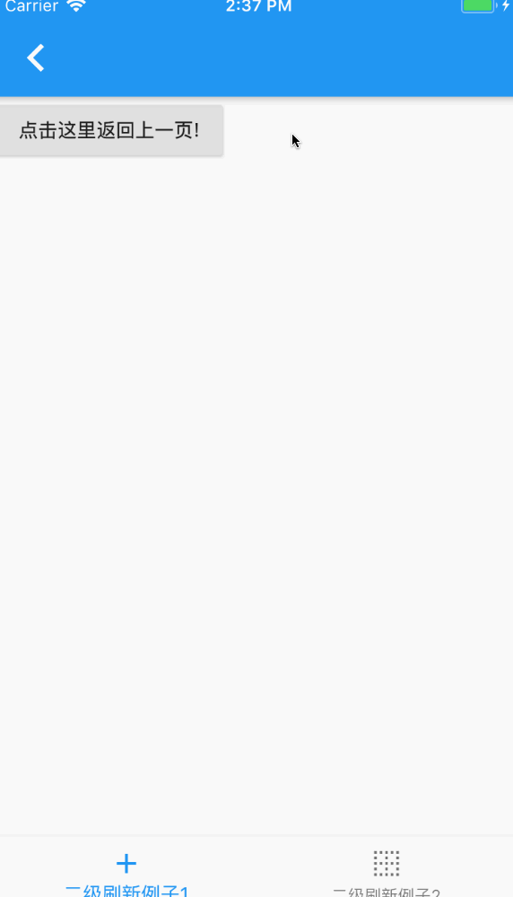
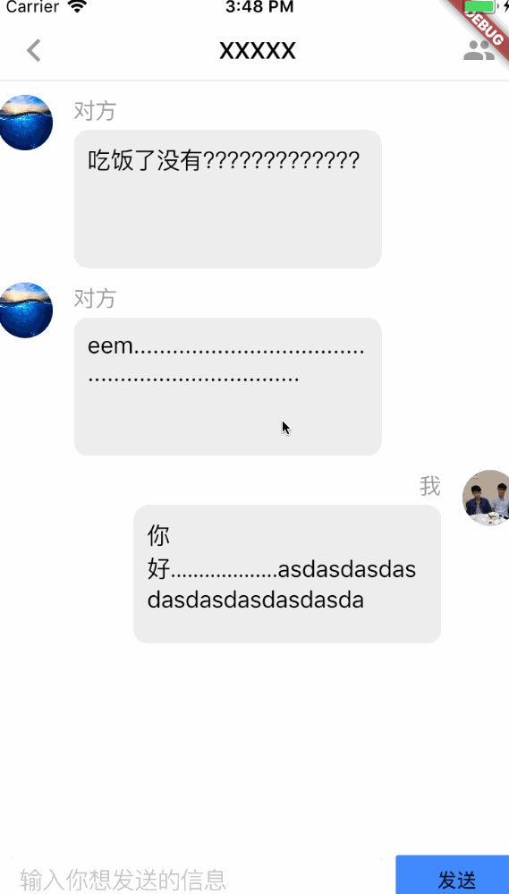
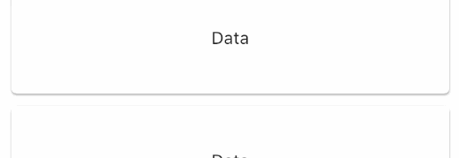
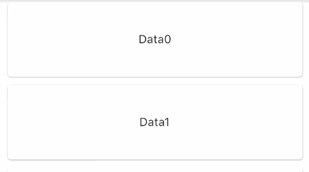
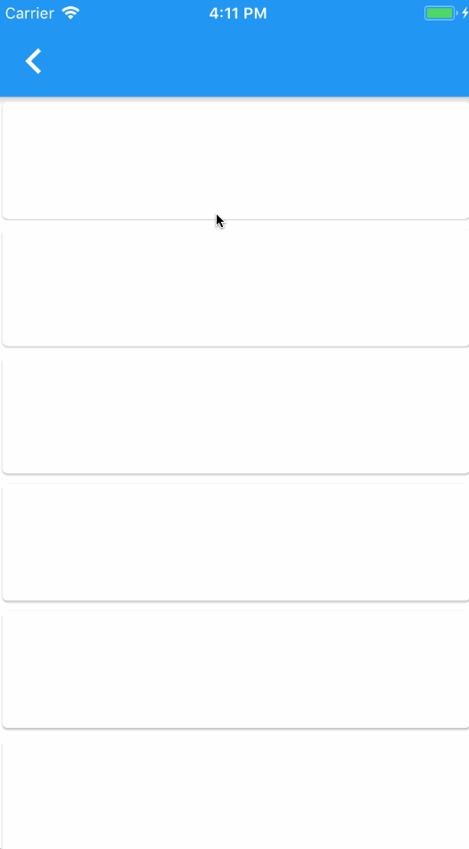

# flutter_pulltorefresh
<a href="https://pub.dev/packages/pull_to_refresh">
  
</a>
<a href="https://flutter.dev/">
  
</a>
<a href="https://opensource.org/licenses/MIT">
  
</a>

## Intro
a widget provided to the flutter scroll component drop-down refresh and pull up load.support android and ios.
If you are Chinese,click here([中文文档](https://github.com/peng8350/flutter_pulltorefresh/blob/master/README_CN.md))

[Download Demo(Android)](demo.apk):


## Features
* pull up load and pull down refresh
* It's almost fit for all Scroll witgets,like GridView,ListView...
* provide global setting of default indicator and property
* provide some most common indicators
* Support Android and iOS default ScrollPhysics,the overScroll distance can be controlled,custom spring animate,damping,speed.
* horizontal and vertical refresh,support reverse ScrollView also(four direction)
* provide more refreshStyle: Behind,Follow,UnFollow,Front,provide more loadmore style
* Support twoLevel refresh,implments just like TaoBao twoLevel,Wechat TwoLevel
* enable link indicator which placing other place,just like Wechat FriendCircle refresh effect

## Usage

```yaml

   dependencies:
     pull_to_refresh: ^1.5.1

```

```dart

    import 'package:pull_to_refresh/pull_to_refresh.dart';

```

```dart

    
  List<String> items = ["1", "2", "3", "4", "5", "6", "7", "8"];
  RefreshController _refreshController =
      RefreshController(initialRefresh: true);

  void _onRefresh() async{
    // monitor network fetch
    await Future.delayed(Duration(milliseconds: 1000));
    // if failed,use refreshFailed()
    _refreshController.refreshCompleted();
  }

  void _onLoading() async{
    // monitor network fetch
    await Future.delayed(Duration(milliseconds: 1000));
    // if failed,use loadFailed(),if no data return,use LoadNodata()
    items.add((items.length+1).toString());
    if(mounted)
    setState(() {

    });
    _refreshController.loadComplete();
  }

  @override
  Widget build(BuildContext context) {
    return Scaffold(
      body: SmartRefresher(
        enablePullDown: true,
        enablePullUp: true,
        header: WaterDropHeader(),
        footer: CustomFooter(
          builder: (BuildContext context,LoadStatus mode){
            Widget body ;
            if(mode==LoadStatus.idle){
              body =  Text("pull up load");
            }
            else if(mode==LoadStatus.loading){
              body =  CupertinoActivityIndicator();
            }
            else if(mode == LoadStatus.failed){
              body = Text("Load Failed!Click retry!");
            }
            else{
              body = Text("No more Data");
            }
            return Container(
              height: 55.0,
              child: Center(child:body),
            );
          },
        ),
        controller: _refreshController,
        onRefresh: _onRefresh,
        onLoading: _onLoading,
        child: ListView.builder(
          itemBuilder: (c, i) => Card(child: Center(child: Text(items[i]))),
          itemExtent: 100.0,
          itemCount: items.length,
        ),
      ),
    );
  }

  // don't forget to dispose refreshController
  @override
  void dispose() {
    // TODO: implement dispose
    _refreshController.dispose();
    super.dispose();
  }

```


In addition, if you have almost the same header and tail indicators for each page, consider using RefreshConfiguration
, which reduces the repeatability of constructing headers and footers for each new page.
At the same time, you can also set some global properties, such as whether to turn on automatic loading, refresh the trigger distance, whether to automatically hide the tail indicator should not meet a page.
the [example](https://github.com/peng8350/flutter_pulltorefresh/blob/master/example/lib/ui/MainActivity.dart) in my demo

```

    RefreshConfiguration(
        headerBuilder: () => WaterDropHeader(),
        footerBuilder:  () => ClassicFooter(),
         headerTriggerDistance: 80.0,
         hideFooterWhenNotFull: true,
        child: .....
    )

```


## ScreenShots

### Examples
|Style| [ basic usage ](example/lib/ui/example/useStage/basic.dart) | [header in other place](example/lib/ui/example/customindicator/link_header_example.dart) |
|:---:|:---:|:---:|
|art|  |  |

|Style| [ reverse + horizontal](example/lib/ui/example/useStage/horizontal+reverse.dart) | [twoLevel refresh](example/lib/ui/example/useStage/twolevel_refresh.dart) |
|:---:|:---:|:---:|
|art|  |  |

|Style| [ use with other widgets](example/lib/ui/example/otherwidget) |  [chat list](example/lib/ui/example/useStage/qq_chat_list.dart) |
|:---:|:---:|:---:|
|art|  |  |

|Style| [ simple custom header(使用SpinKit)](example/lib/ui/example/customindicator/spinkit_header.dart)| [dragableScrollSheet+LoadMore](example/lib/ui/example/otherwidget/draggable_bottomsheet_loadmore.dart)|
|:---:|:---:| :---:|
|art|  |  |


### Indicator

| Refresh Style |   | Loading Style | |
|:---:|:---:|:---:|:---:|
| | |  | |
| | |  | |

|Style| [ClassicIndicator](https://github.com/peng8350/flutter_pulltorefresh/blob/master/lib/src/indicator/classic_indicator.dart) | [WaterDropHeader](https://github.com/peng8350/flutter_pulltorefresh/blob/master/lib/src/indicator/waterdrop_header.dart) |
|:---:|:---:|:---:|
|art|  |  |

|Style| [MaterialClassicHeader](https://github.com/peng8350/flutter_pulltorefresh/blob/master/lib/src/indicator/material_indicator.dart) | [WaterDropMaterialHeader](https://github.com/peng8350/flutter_pulltorefresh/blob/master/lib/src/indicator/material_indicator.dart) |
|:---:|:---:|:---:|
|art|  |  |


|Style| [ShimmerIndicator](example/lib/ui/example/customindicator/shimmer_indicator.dart) | |
|:---:|:---:|:---:|
|art|  |  |


## More
- [Property Document](refresher_controller_en.md) or [Api/Doc](https://pub.dev/documentation/pull_to_refresh/latest/pulltorefresh/SmartRefresher-class.html)
- [Custom Indicator](custom_indicator_en.md)
- [Inner Attribute Of Indicators](indicator_attribute_en.md)
- [Update Log](CHANGELOG.md)
- [Notice](notice_en.md)
- [FAQ](problems_en.md)


## Exist Problems
* about NestedScrollView, refreshing under SliverAppBar is temporarily impossible. 
When you slide down and then slide up quickly, it will return back. The main reason is that
 NestedScrollView does not consider the problem of cross-border elasticity under 
 bouncingScrollPhysics. Relevant flutter issues: 34316, 33367, 29264. This problem 
 can only wait for flutter to fix this.
* SmartRefresher does not have refresh injection into ScrollView under the subtree, that is, if you put AnimatedList or RecordableListView in the child
 is impossible. I have tried many ways to solve this problem and failed. Because of the 
 principle of implementation, I have to append it to the head and tail of slivers. In fact, the problem is not that much of my
Component issues, such as AnimatedList, can't be used with AnimatedList and GridView unless
 I convert AnimatedList to SliverAnimatedList is the solution. At the moment,
 I have a temporary solution to this problem, but it's a bit cumbersome to rewrite the code inside it and then outside ScrollView.
Add SmartRefresher, see my two examples [Example 1](example/lib/other/refresh_animatedlist.dart)和[Example 2](example/lib/other/refresh_recordable_listview.dart)
* As for the problem that active request refresh does not allow users to drag, it is specifically described that when active request refresh list scrolls upwards, the user's dragging gesture should be intercepted to prevent user drag from blocking the operation of request refresh.
I know that setCanDrag in Scrollable State can prevent it, but this method does not mean that it can be called at any time, once the call timing is wrong, it will crash.

## Thanks

[SmartRefreshLayout](https://github.com/scwang90/SmartRefreshLayout)

## LICENSE


```

MIT License

Copyright (c) 2018 Jpeng

Permission is hereby granted, free of charge, to any person obtaining a copy
of this software and associated documentation files (the "Software"), to deal
in the Software without restriction, including without limitation the rights
to use, copy, modify, merge, publish, distribute, sublicense, and/or sell
copies of the Software, and to permit persons to whom the Software is
furnished to do so, subject to the following conditions:

The above copyright notice and this permission notice shall be included in all
copies or substantial portions of the Software.

THE SOFTWARE IS PROVIDED "AS IS", WITHOUT WARRANTY OF ANY KIND, EXPRESS OR
IMPLIED, INCLUDING BUT NOT LIMITED TO THE WARRANTIES OF MERCHANTABILITY,
FITNESS FOR A PARTICULAR PURPOSE AND NONINFRINGEMENT. IN NO EVENT SHALL THE
AUTHORS OR COPYRIGHT HOLDERS BE LIABLE FOR ANY CLAIM, DAMAGES OR OTHER
LIABILITY, WHETHER IN AN ACTION OF CONTRACT, TORT OR OTHERWISE, ARISING FROM,
OUT OF OR IN CONNECTION WITH THE SOFTWARE OR THE USE OR OTHER DEALINGS IN THE
SOFTWARE.


 ```
