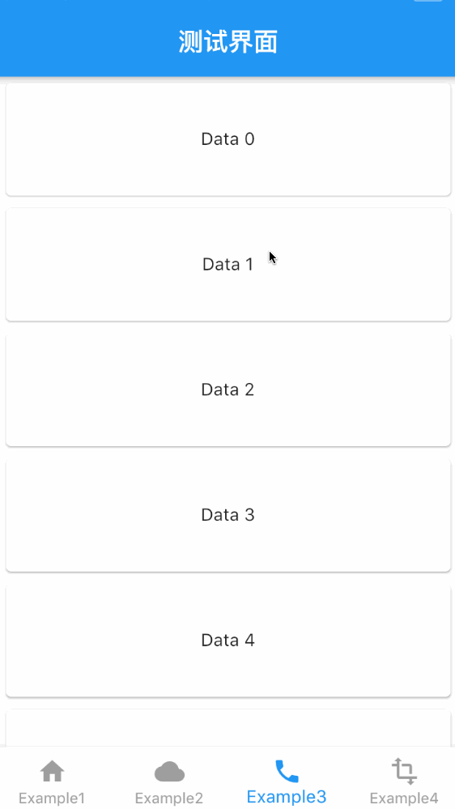

# flutter_pulltorefresh

## Intro
a widget provided to the flutter scroll component drop-down refresh and pull up load.support android and ios.
If you are Chinese,click here([中文文档](https://github.com/peng8350/flutter_pulltorefresh/blob/master/README_CN.md))
(Still in the development stage, the function is not perfect)


## Features
* Android and iOS both spported
* pull up and pull down
* It's almost fit for all witgets,like GridView,ListView,Container,Text...
* High extensibility,High degree of freedom
* powerful Bouncing

## Screenshots

<br>
1.1.0(support reverse ScrollView)
<br>


## How to use?
1.the first declare following in your pubspec.yml

```

   dependencies:
     pull_to_refresh: ^1.1.2
     
```

2.and then,import that line,SmartRefresher is a component that is wrapped outside your content View

```


   import "package:pull_to_refresh/pull_to_refresh.dart";
   ....
   
   build() =>
   
    new SmartRefresher(
        enablePullDown: true,
        enablePullUp: true, 
        onRefresh: _onRefresh,
        onOffsetChange: _onOffsetCallback,
        child: new Container(
          color: Colors.white,
          child: new ListView.builder(
            physics: const NeverScrollableScrollPhysics(),
            shrinkWrap: true,
            itemExtent: 40.0,
            itemCount: data.length,
            itemBuilder: (context,index){
              return data[index];
            },

          ),
        )
    )

```

3.You should set the indicator according to the different refresh mode.build footer is the same with that.
Of course, I have built an indicator convenient to use, called ClassicIndicator. If I do not meet the requirements, I can choose to define an indicator myself.

```


  Widget _buildHeader(context,mode){
   return new ClassicIndicator(mode: mode);
  }
  
 
  Widget _buildFooter(context,mode){
    // the same with header
    ....
  }

  new SmartRefresher(
     ....
     footerBuilder: _buildFooter,
     headerBuilder: _buildHeader
  )


```

4.
Whether at the top or bottom, the onRefresh will be callback when the indicator state is refreshed.
But how can I tell the result to SmartRefresher? It's very simple. It provides a RefreshController inside, you can pass the construction of a controller to SmartRefresher, and then call.SendBack (int status) can change the state of success or failure.

```

    void _onRefresh(bool up){
		if(up){
		   //headerIndicator callback
		   new Future.delayed(const Duration(milliseconds: 2009))
                               .then((val) {
                                 _refreshController.sendBack(true, RefreshStatus.failed);
                           });
		   
		}
		else{
			//footerIndicator Callback
		}
    }

  
```

5.If your content view is a rolling component, such as ScrollView, ListView, GridView and so on, you assign these two attributes to the component.Because my parts are used in the ListView nested package,
this is very important,if you don't notice it,you will get some problems.

```

new ListView(){
    physics: const NeverScrollableScrollPhysics(),
    shrinkWrap: true,
    child:...
}

```

## Props Table

SmartRefresher:

| Attribute Name     |     Attribute Explain     | Parameter Type | Default Value  | requirement |
|---------|--------------------------|:-----:|:-----:|:-----:|
| child      | your content View   | Widget   |   null |  necessary
| headerBuilder | the header indictor     | (BuildContext,int) => Widget  | null |if enablePullDown is necessary,else option |
| footerBuilder | the footer indictor     | (BuildContext,int) => Widget  | null |if enablePullUp is necessary,else option |
| enablePullDown | switch of the pull down      | boolean | true | optional |
| enablePullUp |   switch of the pull up  | boolean | false |optional |
| onRefresh | will callback when the one indicator is getting refreshing   | (bool) => Void | null | optional |
| onOffsetChange | callback while you dragging(In addition to refreshing state and completing,failed state),range: 0~realDistance/triggerDistance     | (bool,double) => Void | null | optional |
| controller | controll inner some states  | RefreshController | null | optional |
| headerConfig |  This setting will affect which type of indicator you use and config contains a lot props,such as triigerDistance,completedurtion...   | Config | RefreshConfig | optional |
| footerConfig |  This setting will affect which type of indicator you use and config contains a lot props,such as triigerDistance,completedurtion...    | Config | LoadConfig | optional |
| enableOverScroll |  the switch of Overscroll,When you use  RefreshIndicator(Material), you may have to shut down.    | bool | true | optional |

## Attention point
1.The component is unbounded, so when you use it, be careful about the problems caused by the height, especially the column, stack, which is also a control of unrestricted height, to be extra careful.
 
 
## LICENSE
 
 ```
 
MIT License

Copyright (c) 2018 Jpeng

Permission is hereby granted, free of charge, to any person obtaining a copy
of this software and associated documentation files (the "Software"), to deal
in the Software without restriction, including without limitation the rights
to use, copy, modify, merge, publish, distribute, sublicense, and/or sell
copies of the Software, and to permit persons to whom the Software is
furnished to do so, subject to the following conditions:

The above copyright notice and this permission notice shall be included in all
copies or substantial portions of the Software.

THE SOFTWARE IS PROVIDED "AS IS", WITHOUT WARRANTY OF ANY KIND, EXPRESS OR
IMPLIED, INCLUDING BUT NOT LIMITED TO THE WARRANTIES OF MERCHANTABILITY,
FITNESS FOR A PARTICULAR PURPOSE AND NONINFRINGEMENT. IN NO EVENT SHALL THE
AUTHORS OR COPYRIGHT HOLDERS BE LIABLE FOR ANY CLAIM, DAMAGES OR OTHER
LIABILITY, WHETHER IN AN ACTION OF CONTRACT, TORT OR OTHERWISE, ARISING FROM,
OUT OF OR IN CONNECTION WITH THE SOFTWARE OR THE USE OR OTHER DEALINGS IN THE
SOFTWARE.

 
 ```