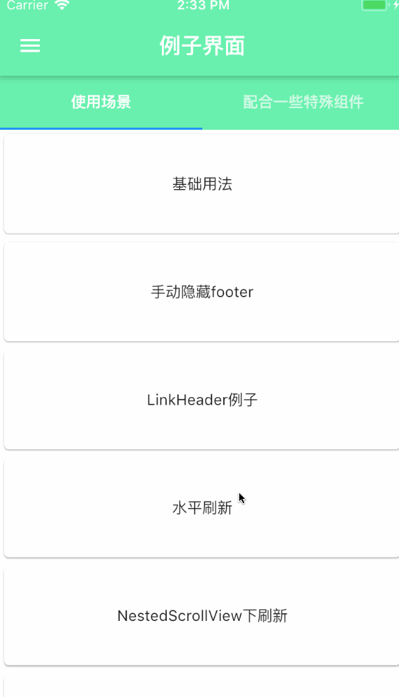
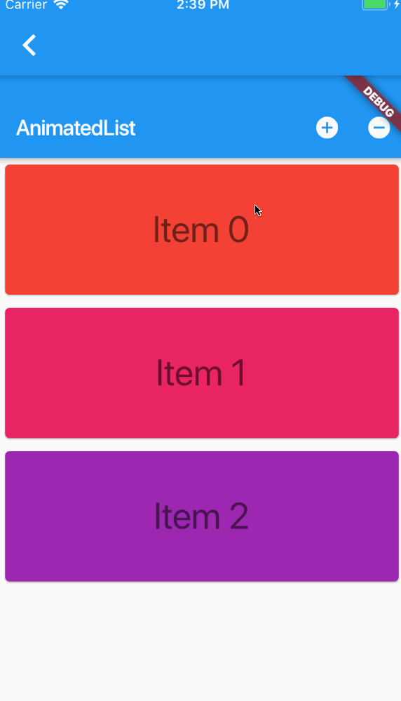
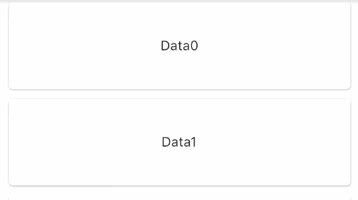
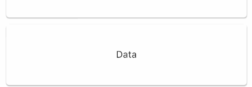
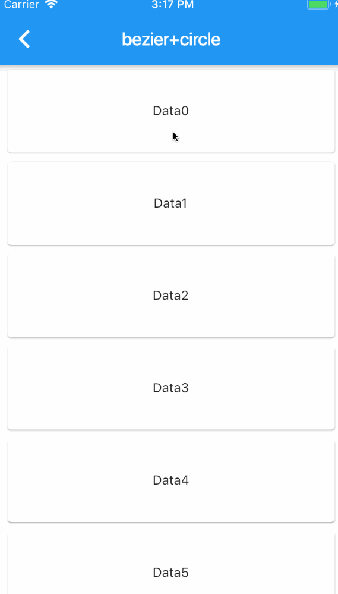

# flutter_pulltorefresh
<a href="https://pub.dev/packages/pull_to_refresh">
  
</a>
<a href="https://flutter.dev/">
  
</a>
<a href="https://opensource.org/licenses/MIT">
  
</a>

## 介绍
一个提供上拉加载和下拉刷新的组件,同时支持Android和Ios<br>

[下载Demo(Android)](demo.apk):


## 特性
* 提供上拉加载和下拉刷新
* 几乎适合所有部件
* 提供全局设置默认指示器和属性
* 提供多种比较常用的指示器
* 支持Android和iOS默认滑动引擎,可限制越界距离,打造自定义弹性动画,速度,阻尼等。
* 支持水平和垂直刷新,同时支持翻转列表(四个方向)
* 提供多种刷新指示器风格:跟随,不跟随,位于背部,位于前部, 提供多种加载更多风格
* 提供二楼刷新,可实现类似淘宝二楼,微信二楼,携程二楼
* 允许关联指示器存放在Viewport外部,即朋友圈刷新效果

## 用法

添加这一行到pubspec.yaml

```yaml

   dependencies:
     pull_to_refresh: ^1.5.5

```

导包

```dart

    import 'package:pull_to_refresh/pull_to_refresh.dart';

```

简单例子如下,另外你要注意SmartRefresher里child存放什么组件有哪些区别,目前出现很多这类的issue。如果你不清楚,请看<a href="#child">这里</a>

```dart

  List<String> items = ["1", "2", "3", "4", "5", "6", "7", "8"];
  RefreshController _refreshController =
      RefreshController(initialRefresh: false);

  void _onRefresh() async{
    // monitor network fetch
    await Future.delayed(Duration(milliseconds: 1000));
    // if failed,use refreshFailed()
    _refreshController.refreshCompleted();
  }

  void _onLoading() async{
    // monitor network fetch
    await Future.delayed(Duration(milliseconds: 1000));
    // if failed,use loadFailed(),if no data return,use LoadNodata()
    items.add((items.length+1).toString());
    if(mounted)
    setState(() {

    });
    _refreshController.loadComplete();
  }

  @override
  Widget build(BuildContext context) {
    return Scaffold(
      body: SmartRefresher(
        enablePullDown: true,
        enablePullUp: true,
        header: WaterDropHeader(),
        footer: CustomFooter(
          builder: (BuildContext context,LoadStatus mode){
            Widget body ;
            if(mode==LoadStatus.idle){
              body =  Text("上拉加载");
            }
            else if(mode==LoadStatus.loading){
              body =  CupertinoActivityIndicator();
            }
            else if(mode == LoadStatus.failed){
              body = Text("加载失败！点击重试！");
            }
            else if(mode == LoadStatus.canLoad){
               body = Text("松手,加载更多!");
            }
            else{
              body = Text("没有更多数据了!");
            }
            return Container(
              height: 55.0,
              child: Center(child:body),
            );
          },
        ),
        controller: _refreshController,
        onRefresh: _onRefresh,
        onLoading: _onLoading,
        child: ListView.builder(
          itemBuilder: (c, i) => Card(child: Center(child: Text(items[i]))),
          itemExtent: 100.0,
          itemCount: items.length,
        ),
      ),
    );
  }

  // 1.5.0后,应该没有必要加这一行了
 // @override
 // void dispose() {
    // TODO: implement dispose
 //   _refreshController.dispose();
//    super.dispose();
//  }

```

全局配置RefreshConfiguration,配置子树下的所有SmartRefresher表现,一般存放于MaterialApp的根部,用法和ScrollConfiguration是类似的。
另外,假如你某一个SmartRefresher表现和全局不一样的情况,你可以使用RefreshConfiguration.copyAncestor从祖先RefreshConfiguration复制属性过来并替换不为空的属性。

```dart
    // 全局配置子树下的SmartRefresher,下面列举几个特别重要的属性
     RefreshConfiguration(
         headerBuilder: () => WaterDropHeader(),        // 配置默认头部指示器,假如你每个页面的头部指示器都一样的话,你需要设置这个
         footerBuilder:  () => ClassicFooter(),        // 配置默认底部指示器
         headerTriggerDistance: 80.0,        // 头部触发刷新的越界距离
         springDescription:SpringDescription(stiffness: 170, damping: 16, mass: 1.9),         // 自定义回弹动画,三个属性值意义请查询flutter api
         maxOverScrollExtent :100, //头部最大可以拖动的范围,如果发生冲出视图范围区域,请设置这个属性
         maxUnderScrollExtent:0, // 底部最大可以拖动的范围
         enableScrollWhenRefreshCompleted: true, //这个属性不兼容PageView和TabBarView,如果你特别需要TabBarView左右滑动,你需要把它设置为true
         enableLoadingWhenFailed : true, //在加载失败的状态下,用户仍然可以通过手势上拉来触发加载更多
         hideFooterWhenNotFull: false, // Viewport不满一屏时,禁用上拉加载更多功能
         enableBallisticLoad: true, // 可以通过惯性滑动触发加载更多
        child: MaterialApp(
            ........
        )
    );

```


## 截图
### 例子
|Style| [基础用法](example/lib/ui/example/useStage/basic.dart) | [header放在其他位置](example/lib/ui/example/customindicator/link_header_example.dart) | [水平+翻转刷新](example/lib/ui/example/useStage/horizontal+reverse.dart) |
|:---:|:---:|:---:|:---:|
||  |  | |

|Style|  [二楼刷新](example/lib/ui/example/useStage/twolevel_refresh.dart) |[兼容其他特殊组件](example/lib/ui/example/otherwidget) |  [聊天列表](example/lib/ui/example/useStage/qq_chat_list.dart) |
|:---:|:---:|:---:|:---:|
||   | |  |


|Style| [简单自定义刷新指示器(使用SpinKit)](example/lib/ui/example/customindicator/spinkit_header.dart)| [dragableScrollSheet+LoadMore](example/lib/ui/example/otherwidget/draggable_bottomsheet_loadmore.dart)|[Gif Indicator](example/lib/ui/example/customindicator/gif_indicator_example1.dart) |
|:---:|:---:|:---:|:---:|
||  |  |  |

### 各种指示器

| 下拉刷新风格 |   |上拉加载风格| |
|:---:|:---:|:---:|:---:|
| | |  | |
| | |  | |

|Style| [ClassicIndicator](https://github.com/peng8350/flutter_pulltorefresh/blob/master/lib/src/indicator/classic_indicator.dart) | [WaterDropHeader](https://github.com/peng8350/flutter_pulltorefresh/blob/master/lib/src/indicator/waterdrop_header.dart) | [MaterialClassicHeader](https://github.com/peng8350/flutter_pulltorefresh/blob/master/lib/src/indicator/material_indicator.dart) |
|:---:|:---:|:---:|:---:|
||  |  |  |

|Style|  [WaterDropMaterialHeader](https://github.com/peng8350/flutter_pulltorefresh/blob/master/lib/src/indicator/material_indicator.dart) | [Bezier+circle](example/lib/ui/example/customindicator/shimmer_indicator.dart) |[Bezier+Circle](https://github.com/peng8350/flutter_pulltorefresh/blob/master/lib/src/indicator/bezier_indicator.dart) |
|:---:|:---:|:---:|:---:|
||   | |  |

<a name="child"></a>

## 对SmartRefresher里child详细说明

自1.4.3,child属性从ScrollView转变为Widget,但是这并不意味着对于所有Widget处理是一样的。SmartRefresher内部实现机制并非是类如NestedScrollView<br><br>
这里的处理机制分了两个大类,`第一类`是继承于ScrollView的那一类组件,目前来说,就只有这三种,`ListView`,`GridView`,`CustomScrollView`。`第二类`,是非继承于ScrollView的那类组件,一般是存放空视图,非滚动视图(非滚动转化为滚动),PageView,无需你自己通过`LayoutBuilder`估计高度。<br><br>
对于第一类的处理机制是从内部"非法"取出slivers。第二类,则是把child直接放进类如`SliverToBoxAdapter`。通过前后拼接header和footer组成slivers,然后SmartRefresher内部把slivers放进`CustomScrollView`,你可以把SmartRefresher理解成`CustomScrollView`,因为内部就是返回CustomScrollView。所以,这里child结点是不是ScrollView区别是很大的。
<br><br>
现在,猜想你有一个需求:需要在ScrollView外部增加背景,滚动条什么的。下面演示错误和正确的做法

```dart

   // 错误的做法
   SmartRefresher(
      child: ScrollBar(
          child: ListView(
             ....
      )
    )
   )

   // 正确的做法
   ScrollBar(
      child: SmartRefresher(
          child: ListView(
             ....
      )
    )
   )

```

再演示多一种错误做法,把ScrollView存放到另外一个widget

```dart

   //error
   SmartRefresher(
      child:MainView()
   )

   class MainView extends StatelessWidget{
       Widget build(){
          return ListView(
             ....
          );
       }

   }

```

上面的错误做法就导致了scrollable再嵌套一个scrollable了,导致你无论怎么滑也看不到header和footer。
同理的,你可能需要配合NotificationListener,ScrollConfiguration...这类组件,记住,千万别在ScrollView(你想增加刷新部分)外和SmartRefresher内存放。


## 更多
- [属性文档](refresher_controller.md) 或者 [Api/Doc](https://pub.dev/documentation/pull_to_refresh/latest/pulltorefresh/SmartRefresher-class.html)
- [自定义指示器](custom_indicator.md)
- [指示器内部属性介绍](indicator_attribute.md)
- [更新日志](CHANGELOG.md)
- [注意地方](notice.md)
- [常见问题](problems.md)

## 暂时存在的问题
* 关于配合NestedScrollView一起使用,会出现很多奇怪的现象,当你下滑然后快速上滑,
它会出现跳动,主要是NestedScrollView没有考虑到在BouncingScrollPhysics下的越界问题,相关flutter issue:
34316,33367,29264,这个问题只能等待flutter修复。
* SmartRefresher不具有向子树下的ScrollView注入刷新功能,也就是如果直接把AnimatedList,RecordableListView放在child结点是不行的,这个问题我尝试过很多个方法都失败了,由于实现原理,我必须得在slivers头部和尾部追加,事实上,这个问题也不大是我组件的问题,比如说AnimatedList,假如我要结合AnimatedList和GridView一起使用是没办法的,唯有把AnimatedList转换为SliverAnimatedList才能解决。目前呢,面对这种问题的话,我已经有临时的解决方案,但有点麻烦,要重写它内部的代码,然后在ScrollView外部
增加SmartRefresher,详见我这两个例子[例子1](example/lib/other/refresh_animatedlist.dart)和[例子2](example/lib/other/refresh_recordable_listview.dart)


## 感谢

[SmartRefreshLayout](https://github.com/scwang90/SmartRefreshLayout)


## 开源协议

```

MIT License

Copyright (c) 2018 Jpeng

Permission is hereby granted, free of charge, to any person obtaining a copy
of this software and associated documentation files (the "Software"), to deal
in the Software without restriction, including without limitation the rights
to use, copy, modify, merge, publish, distribute, sublicense, and/or sell
copies of the Software, and to permit persons to whom the Software is
furnished to do so, subject to the following conditions:

The above copyright notice and this permission notice shall be included in all
copies or substantial portions of the Software.

THE SOFTWARE IS PROVIDED "AS IS", WITHOUT WARRANTY OF ANY KIND, EXPRESS OR
IMPLIED, INCLUDING BUT NOT LIMITED TO THE WARRANTIES OF MERCHANTABILITY,
FITNESS FOR A PARTICULAR PURPOSE AND NONINFRINGEMENT. IN NO EVENT SHALL THE
AUTHORS OR COPYRIGHT HOLDERS BE LIABLE FOR ANY CLAIM, DAMAGES OR OTHER
LIABILITY, WHETHER IN AN ACTION OF CONTRACT, TORT OR OTHERWISE, ARISING FROM,
OUT OF OR IN CONNECTION WITH THE SOFTWARE OR THE USE OR OTHER DEALINGS IN THE
SOFTWARE.


 ```