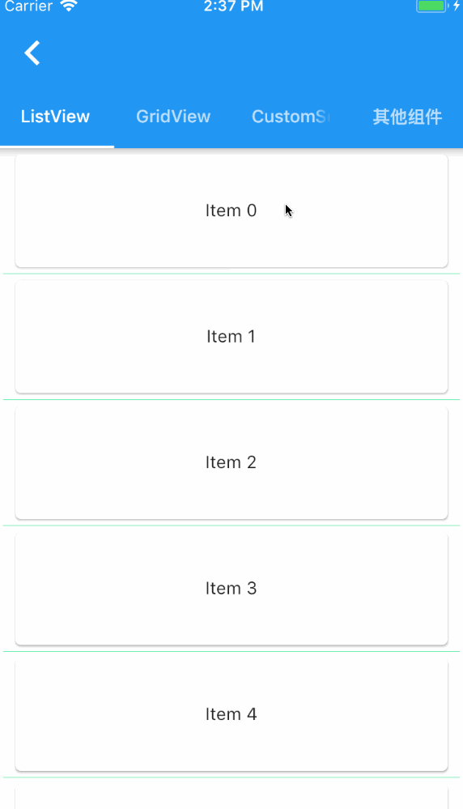
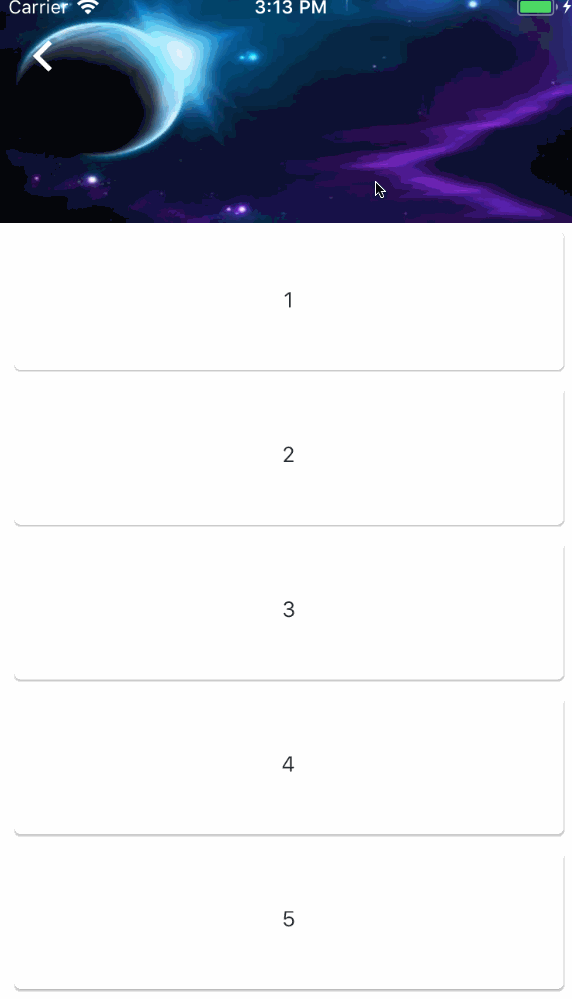
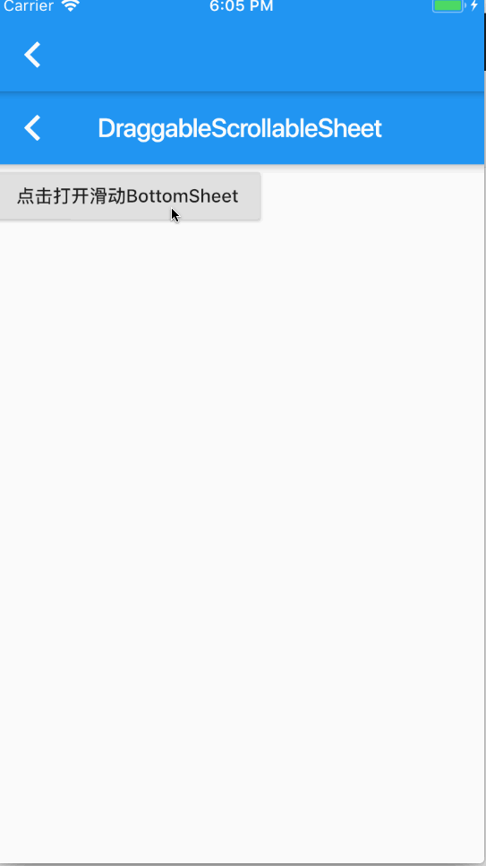
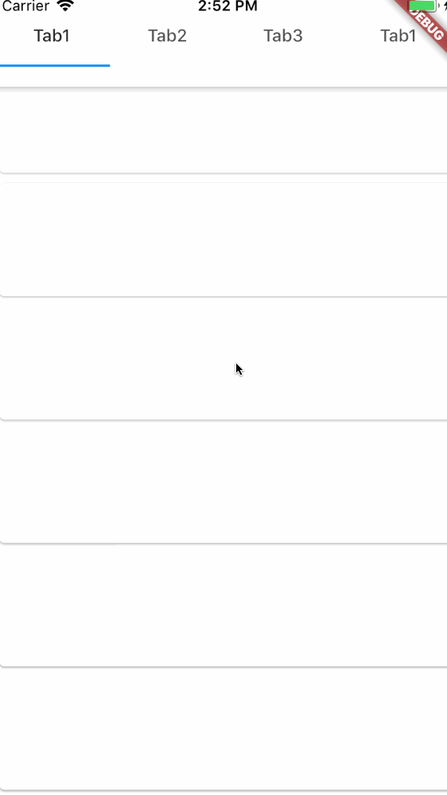

# flutter_pulltorefresh
<a href="https://pub.dev/packages/pull_to_refresh">
  
</a>
<a href="https://flutter.dev/">
  
</a>
<a href="https://opensource.org/licenses/MIT">
  
</a>

## 介绍
一个提供上拉加载和下拉刷新的组件,同时支持Android和Ios<br>

[下载Demo(Android)](demo.apk):


## 特性
* 提供上拉加载和下拉刷新
* 几乎适合所有部件
* 提供全局设置默认指示器和属性
* 提供多种比较常用的指示器
* 支持Android和iOS默认滑动引擎,可限制越界距离,打造自定义弹性动画,速度,阻尼等。
* 支持水平和垂直刷新,同时支持翻转列表(四个方向)
* 提供多种刷新指示器风格:跟随,不跟随,位于背部,位于前部, 提供多种加载更多风格
* 提供二楼刷新,可实现类似淘宝二楼,微信二楼,携程二楼
* 允许关联指示器存放在Viewport外部,即朋友圈刷新效果

## 用法

```yaml

   dependencies:
     pull_to_refresh: ^1.5.0

```

```dart

    import 'package:pull_to_refresh/pull_to_refresh.dart';

```

```dart
    
  List<String> items = ["1", "2", "3", "4", "5", "6", "7", "8"];
  RefreshController _refreshController =
      RefreshController(initialRefresh: true);

  void _onRefresh() async{
    // monitor network fetch
    await Future.delayed(Duration(milliseconds: 1000));
    // if failed,use refreshFailed()
    _refreshController.refreshCompleted();
  }

  void _onLoading() async{
    // monitor network fetch
    await Future.delayed(Duration(milliseconds: 1000));
    // if failed,use loadFailed(),if no data return,use LoadNodata()
    items.add((items.length+1).toString());
    if(mounted)
    setState(() {

    });
    _refreshController.loadComplete();
  }

  @override
  Widget build(BuildContext context) {
    return Scaffold(
      body: SmartRefresher(
        enablePullDown: true,
        enablePullUp: true,
        header: WaterDropHeader(),
        footer: CustomFooter(
          builder: (BuildContext context,LoadStatus mode){
            Widget body ;
            if(mode==LoadStatus.idle){
              body =  Text("pull up load");
            }
            else if(mode==LoadStatus.loading){
              body =  CupertinoActivityIndicator();
            }
            else if(mode == LoadStatus.failed){
              body = Text("Load Failed!Click retry!");
            }
            else{
              body = Text("No more Data");
            }
            return Container(
              height: 55.0,
              child: Center(child:body),
            );
          },
        ),
        controller: _refreshController,
        onRefresh: _onRefresh,
        onLoading: _onLoading,
        child: ListView.builder(
          itemBuilder: (c, i) => Card(child: Center(child: Text(items[i]))),
          itemExtent: 100.0,
          itemCount: items.length,
        ),
      ),
    );
  }

  // don't forget to dispose refreshController
  @override
  void dispose() {
    // TODO: implement dispose
    _refreshController.dispose();
    super.dispose();
  }

```


另外,假如你每个页面的头部和尾部指示器几乎都是一样的情况下,可以考虑使用RefreshConfiguration,使用这个可以减少每次新建页面构造
header和footer的重复性的工作,在RefreshConfiguration子树下的SmartRefresher没有header和footer节点默认会采用IndicatorConfiguration的指示器。
同时,你也可以设置一些全局的属性,比如是否开启自动加载,刷新触发距离,是否自动隐藏尾部指示器当不满足一页。[例子](https://github.com/peng8350/flutter_pulltorefresh/blob/master/example/lib/ui/MainActivity.dart)里有使用到这个

```
     RefreshConfiguration(
        headerBuilder: () => WaterDropHeader(),
        footerBuilder:  () => ClassicFooter(),
         headerTriggerDistance: 80.0,
         hideFooterWhenNotFull: true,
        child: .....
    );
    
```

## 截图
### 例子
|Style| [基础用法](example/lib/ui/example/useStage/basic.dart) | [header放在其他位置](example/lib/ui/example/customindicator/link_header_example.dart) |
|:---:|:---:|:---:|
|art|  |  |

|Style| [水平+翻转刷新](example/lib/ui/example/useStage/horizontal+reverse.dart) | [二楼刷新](example/lib/ui/example/useStage/twolevel_refresh.dart) |
|:---:|:---:|:---:|
|art|  |  |

|Style| [兼容其他特殊组件](example/lib/ui/example/otherwidget) |  [聊天列表](example/lib/ui/example/useStage/qq_chat_list.dart) |
|:---:|:---:|:---:|
|art|  |  |

|Style| [简单自定义刷新指示器(使用SpinKit)](example/lib/ui/example/customindicator/spinkit_header.dart)| [dragableScrollSheet+LoadMore](example/lib/ui/example/otherwidget/draggable_bottomsheet_loadmore.dart)|
|:---:|:---:|:---:|
|art|  |  |

### 各种指示器

| 下拉刷新风格 |   |上拉加载风格| |
|:---:|:---:|:---:|:---:|
| | |  | |
| | |  | |


|Style| [ClassicIndicator](https://github.com/peng8350/flutter_pulltorefresh/blob/master/lib/src/indicator/classic_indicator.dart) | [WaterDropHeader](https://github.com/peng8350/flutter_pulltorefresh/blob/master/lib/src/indicator/waterdrop_header.dart) |
|:---:|:---:|:---:|
|art|  |  |

|Style| [MaterialClassicHeader](https://github.com/peng8350/flutter_pulltorefresh/blob/master/lib/src/indicator/material_indicator.dart) | [WaterDropMaterialHeader](https://github.com/peng8350/flutter_pulltorefresh/blob/master/lib/src/indicator/material_indicator.dart) |
|:---:|:---:|:---:|
|art|  |  |

|Style| [ShimmerIndicator](example/lib/ui/example/customindicator/shimmer_indicator.dart) | |
|:---:|:---:|:---:|
|art|  |  |


## 更多
- [属性文档](refresher_controller.md)
- [自定义指示器](custom_indicator.md)
- [指示器内部属性介绍](indicator_attribute.md)
- [更新日志](CHANGELOG.md)
- [注意地方](notice.md)
- [常见问题](problems.md)

## 暂时存在的问题
* 关于配合NestedScrollView,在SliverAppBar下面做刷新的功能暂时是没办法实现的,当你下滑然后快速上滑,
它会出现跳动,主要是NestedScrollView没有考虑到在BouncingScrollPhysics下的越界问题,相关flutter issue:
34316,33367,29264,这个问题只能等待flutter修复。
* SmartRefresher不具有向子树下的ScrollView注入刷新功能,也就是如果直接把AnimatedList,RecordableListView放在child结点是不行的,这个问题我尝试过很多个方法都失败了,由于实现原理,我必须得在slivers头部和尾部追加,事实上,这个问题也不大是我组件的问题,比如说AnimatedList,假如我要结合AnimatedList和GridView一起使用是没办法的,唯有把AnimatedList转换为SliverAnimatedList才能解决。目前呢,面对这种问题的话,我已经有临时的解决方案,但有点麻烦,要重写它内部的代码,然后在ScrollView外部
增加SmartRefresher,详见我这两个例子[例子1](example/lib/other/refresh_animatedlist.dart)和[例子2](example/lib/other/refresh_recordable_listview.dart)
* 关于主动请求刷新不允许用户拖动问题,具体描述:当主动请求刷新列表往上滚动时,应该要拦截用户拖动的手势,防止用户拖动阻断了请求刷新的操作。
这个问题目前我还没有很好的解决办法,我知道ScrollableState里setCanDrag可以阻止它,但是这个方法不是说随时都可以调用,一旦调用时机不对,就会奔溃。


## 感谢

[SmartRefreshLayout](https://github.com/scwang90/SmartRefreshLayout)


## 开源协议

```

MIT License

Copyright (c) 2018 Jpeng

Permission is hereby granted, free of charge, to any person obtaining a copy
of this software and associated documentation files (the "Software"), to deal
in the Software without restriction, including without limitation the rights
to use, copy, modify, merge, publish, distribute, sublicense, and/or sell
copies of the Software, and to permit persons to whom the Software is
furnished to do so, subject to the following conditions:

The above copyright notice and this permission notice shall be included in all
copies or substantial portions of the Software.

THE SOFTWARE IS PROVIDED "AS IS", WITHOUT WARRANTY OF ANY KIND, EXPRESS OR
IMPLIED, INCLUDING BUT NOT LIMITED TO THE WARRANTIES OF MERCHANTABILITY,
FITNESS FOR A PARTICULAR PURPOSE AND NONINFRINGEMENT. IN NO EVENT SHALL THE
AUTHORS OR COPYRIGHT HOLDERS BE LIABLE FOR ANY CLAIM, DAMAGES OR OTHER
LIABILITY, WHETHER IN AN ACTION OF CONTRACT, TORT OR OTHERWISE, ARISING FROM,
OUT OF OR IN CONNECTION WITH THE SOFTWARE OR THE USE OR OTHER DEALINGS IN THE
SOFTWARE.


 ```