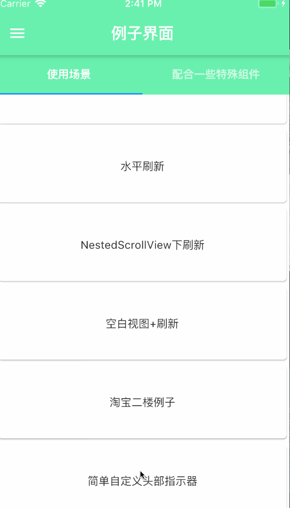

# flutter_pulltorefresh

## 介绍
一个提供上拉加载和下拉刷新的组件,同时支持Android和Ios

## 特性
* 提供上拉加载和下拉刷新
* 几乎适合所有部件
* 提供全局设置默认指示器和属性
* 提供多种比较常用的指示器
* 支持Android和iOS默认滑动引擎,可限制越界距离
* 支持水平和垂直刷新,同时支持翻转列表(四个方向)
* 提供多种刷新指示器风格:跟随,不跟随,位于背部,位于前部
* 提供二楼刷新,可实现类似淘宝二楼,微信二楼,携程二楼
* 允许关联指示器存放在Viewport外部,即朋友圈刷新效果

## 用法
提示:<br>
1.因1.3.0对内部进行了很大的变动,1.3.0~1.3.9版本不建议使用,Bug较多,1.4.0开始稳定<br>
2.确保flutter版本大于等于1.2.1

```

   dependencies:
     pull_to_refresh: ^1.4.7

```

```
import 'package:pull_to_refresh/pull_to_refresh.dart';


RefreshController _refreshController= RefreshController(initialRefresh:true);;

void _onRefresh(){
   /*.  after the data return,
        use _refreshController.refreshComplete() or refreshFailed() to end refreshing
   */
}

void _onLoading(){
   /*
        use _refreshController.loadComplete() or loadNoData(),loadFailed() to end loading
   */
}

build(){
...
SmartRefresher(
      enablePullDown: true,
      enablePullUp: true,
      header: defaultTargetPlatform == TargetPlatform.iOS?WaterDropHeader():WaterDropMaterialHeader(),
      controller: _refreshController,
      onRefresh: _onRefresh,
      onLoading: _onLoading,
      child: "child",
    )
....
}

// don't forget to dispose refreshController
void dispose(){
    _refreshController.dispose();
    super.dispose();
}

```


另外,假如你每个页面的头部和尾部指示器几乎都是一样的情况下,可以考虑使用RefreshConfiguration,使用这个可以减少每次新建页面构造
header和footer的重复性的工作,在RefreshConfiguration子树下的SmartRefresher没有header和footer节点默认会采用IndicatorConfiguration的指示器。
同时,你也可以设置一些全局的属性,比如是否开启自动加载,刷新触发距离,是否自动隐藏尾部指示器当不满足一页。[例子](https://github.com/peng8350/flutter_pulltorefresh/blob/master/example/lib/ui/MainActivity.dart)里有使用到这个

```

    RefreshConfiguration(
        headerBuilder: () => WaterDropHeader(),
        footerBuilder:  () => ClassicFooter(),
        clickLoadingWhenIdle: true,
         headerTriggerDistance: 80.0,
         hideFooterWhenNotFull: true,
        child: .....
    )

```

最后,[这里](https://github.com/peng8350/flutter_pulltorefresh/tree/master/example/lib/ui/example)提供了各种例子实现你所需要的功能

## 截图
### 例子
|Style| [基础用法](example/lib/ui/example/useStage/basic.dart) | [header放在其他位置](example/lib/ui/example/useStage/link_header_example.dart) |
|:---:|:---:|:---:|
|art|  |  |

|Style| [水平+翻转刷新](example/lib/ui/example/useStage/horizontal+reverse.dart) | [二楼刷新](example/lib/ui/example/useStage/twolevel_refresh.dart) |
|:---:|:---:|:---:|
|art|  |  |

|Style| [兼容其他特殊组件](example/lib/ui/example/otherwidget) |  [空白视图](example/lib/ui/example/useStage/empty_view.dart) |
|:---:|:---:|:---:|
|art|  |  |

|Style| [简单自定义刷新指示器(使用SpinKit)](example/lib/ui/example/useStage/custom_header.dart)|
|:---:|:---:|
|art|  |

### 各种指示器

|Style| [ClassicIndicator](https://github.com/peng8350/flutter_pulltorefresh/blob/master/lib/src/indicator/classic_indicator.dart) | [WaterDropHeader](https://github.com/peng8350/flutter_pulltorefresh/blob/master/lib/src/indicator/waterdrop_header.dart) |
|:---:|:---:|:---:|
|art|  |  |

|Style| [MaterialClassicHeader](https://github.com/peng8350/flutter_pulltorefresh/blob/master/lib/src/indicator/material_indicator.dart) | [WaterDropMaterialHeader](https://github.com/peng8350/flutter_pulltorefresh/blob/master/lib/src/indicator/material_indicator.dart) |
|:---:|:---:|:---:|
|art|  |  |


## 更多
- [SmartRefresher,RefreshController](refresher_controller.md)
- [自定义指示器](custom_indicator.md)
- [指示器内部属性介绍](indicator_attribute.md)
- [更新日志](CHANGELOG.md)
- [注意地方](notice.md)

## F.A.Q
* <h3>IOS状态栏双击为什么ListView不自动滚动到顶部?</h3>
这个问题经测试不是我封装的失误,当ListView里的controller被替换后,这个问题就会出现,原因大概是Scaffold里的处理操作,请issue flutter。

* <h3>NestedScrollView兼容性?</h3>
不建议使用NestedScrollView,目前我已经发现了一个问题(与BouncingScrollPhysics冲突),这个问题在flutter issue里也有很多类似的(33367,34316),只能等待flutter解决这个问题,
所以最好用CustomScrollView,避免使用它,因为可能还有很多未知的问题我还没有发现。

* <h3>为什么使用CuperNavigationBar后(不只这一个情况),上面好像被遮住了一部分</h3>
因为我内部就是采用CustomScrollView来实现的,而CustomScrollView它不像BoxScrollView会帮你注入padding,所以需要你自己注入padding或者使用SafeArea

* <h3>兼容性方面?</h3>
自1.3.0换了一套新的方法去实现指示器，内部指示器实现是通过监听scrollController位置变化来实现的，并没有使用到类如NotificationListener和GestureDector这类可能引起滑动手势冲突的方法，
所以应该可以兼容大多需要利用到手势之间的库。但是，可能不兼容一些库需要改写ScrollPhysics，内部的FrontStyle就很明显需要用到这个。

## 感谢

[SmartRefreshLayout](https://github.com/scwang90/SmartRefreshLayout)


## 开源协议

```

MIT License

Copyright (c) 2018 Jpeng

Permission is hereby granted, free of charge, to any person obtaining a copy
of this software and associated documentation files (the "Software"), to deal
in the Software without restriction, including without limitation the rights
to use, copy, modify, merge, publish, distribute, sublicense, and/or sell
copies of the Software, and to permit persons to whom the Software is
furnished to do so, subject to the following conditions:

The above copyright notice and this permission notice shall be included in all
copies or substantial portions of the Software.

THE SOFTWARE IS PROVIDED "AS IS", WITHOUT WARRANTY OF ANY KIND, EXPRESS OR
IMPLIED, INCLUDING BUT NOT LIMITED TO THE WARRANTIES OF MERCHANTABILITY,
FITNESS FOR A PARTICULAR PURPOSE AND NONINFRINGEMENT. IN NO EVENT SHALL THE
AUTHORS OR COPYRIGHT HOLDERS BE LIABLE FOR ANY CLAIM, DAMAGES OR OTHER
LIABILITY, WHETHER IN AN ACTION OF CONTRACT, TORT OR OTHERWISE, ARISING FROM,
OUT OF OR IN CONNECTION WITH THE SOFTWARE OR THE USE OR OTHER DEALINGS IN THE
SOFTWARE.


 ```