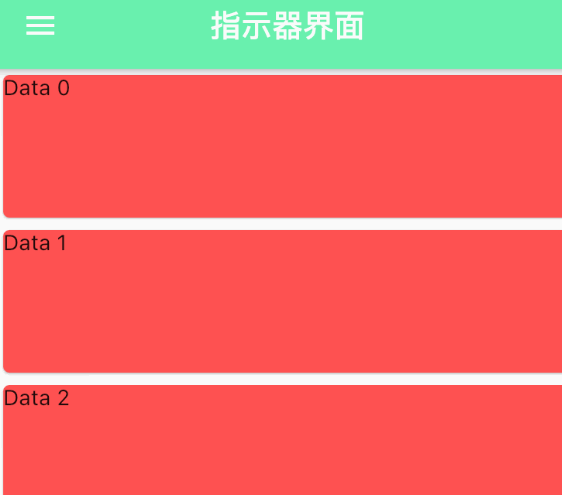

# 关于自定义指示器
有时,我们可能嫌弃提供指示器不太好看,或者不符合自己要求,需要自己去定义一个属于自己App的指示器。
现提供两种自定义指示器的方法。

## 第一种
假设你要实现的指示器功能不是太过于复杂,可以使用CustomHeader或者CustomFooter,利用SmartRefresher里的onOffsetChange回调可完成一些简单的动画。

```
   Widget buildHeader(BuildContext context,RefreshStatus mode){
      return Center(
          child:Text(mode==RefreshStatus.idle?"下拉刷新":mode==RefreshStatus.refreshing?"刷新中...":
          mode==RefreshStatus.canRefresh?"可以松手了!":mode==RefreshStatus.completed?"刷新成功!":"刷新失败");
      )
   }

   SmartRefresher(
      ...
      header: CustomHeader(builder:buildHeader)
      onOffsetChange:(offset){
        //do some ani
      }
      ...
   )

```

## 第二种

这种方式可能相对上面难说实现起来是相对来说比较复杂的,但通过这种方式可以更好的实现一些比较绚丽的动画。
首先,头部指示器(下拉刷新)有四种风格:Follow,UnFollow,Behind,Front,底部指示器(加载更多)只有一种风格:Follow
先来了解一下这四种风格到底有什么区别?

* Follow: 高度不会变化,而位置会随着列表的移动而移动
* UnFollow: 高度不会变化,位置不变，但不是跟着列表变化,当它完全可以被看见时，不会再跟随列表。
* Behind:高度会随着越界拖动距离变化,不会移动。
* Front: 和前面三种机制不一样,高度不会变动,位置也不会变动。一直卡在列表顶端。


首先,头部指示器继承RefreshIndicator,底部指示器继承LoadIndicator,同时内部已经封装好State(RefreshIndicatorState,LoadIndicatorState)。
这里,你不需要去关心一些问题就是:通过什么去监听指示器offset的变化?如何去让指示器进入某个状态?怎么根据offset来决定是否进入刷新状态?
怎么颁布刷新状态变化逻辑? 上述这些问题你不需要去关心,因为我内部已经处理好这些问题。你只需要关心以下东西:
不同的状态要返回什么布局,根据offset变化来设置一些动画的进度,进入刷新状态前执行什么操作等等。

下面直接以实现一个简单的指示器为例子,这样才能更好的明白怎么设计一个指示器。
现在,猜想我们要实现一个这样的指示器,如下图:


拖动时,随着offset的变化而变化图片大小,然后刷新完毕后,调用一个平移动画形成跑过去的效果。
那么,问题来了,我们应该要怎么去实现这样的功能呢?
首先,我准备了一张jpg和一个gif,jpg表示gif第一帧,当然如果你想控制gif,也是有办法的,一个gif够了
定义一个类继承RefreshIndicator(注意material包重名)

```

class RunningHeader extends RefreshIndicator {
  RunningHeader({@required OnRefresh onRefresh})
      : super(
            refreshStyle: RefreshStyle.Follow,
            height: 80.0,
            onRefresh: onRefresh);

  @override
  State<StatefulWidget> createState() {
    // TODO: implement createState
    return RunningHeaderState();
  }
}

```
如上,RefreshIndicator具体有什么属性,可以看[这里](indicator_attribute.md),利用super(refreshStyle:)可以指定指示器的风格,因为这里我觉得
Follow更适合一点,所以就选Follow了。

接下来RunningHeaderState是重点部分,它继承于RefreshIndicatorState而不是State。内部有一个必须得重写的方法buildContent,用来指定指示器要显示什么,这个我相信绝大数人都能明白,就不细说了。
第一步,如何实现拖动手势过程中人缩小放大?缩小放大肯定是要用ScaleTransition,那么问题又来了,那我怎么去知道当前offset是多少呢?
内部有一个onOffsetChange的回调方法,这个方法触发的时机是任何时候都会触发的,如果你不想在刷新过程中或者布局浮动的状态下触发,你可以利用floating这个属性,这个
属性表示指示器是否占有一个高度的状态,假如占有一个高度,它就能被看到,假如没有,就滚回去隐藏掉了。

```

class RunningHeaderState extends RefreshIndicatorState<RunningHeader>
    with TickerProviderStateMixin {

    AnimationController _scaleAnimation;

    void onOffsetChange(){
         if (!floating) {
              _scaleAnimation.value = offset / 80.0;
            }
         //call super,will call setState
         super.onOffsetChange(offset);
    }
    Widget buildContent(BuildContext context, RefreshStatus mode){
        return ScaleTransition(
                child: (mode != RefreshStatus.idle || mode != RefreshStatus.canRefresh)
                    ? Image.asset("images/custom_2.gif")
                    : Image.asset("images/custom_1.jpg"),
                scale: _scaleAnimation,
        );
    }

}


```

第二步,那个刷新完成之后人跑过去的效果怎么弄?这点需要endRefresh这个方法,这个方法要返回一个Future。注意,这个方法调用,此时的状态是RefreshStatus.completed或者failed
,然后当这个方法执行完毕,此时,floating =false,header就会开始隐藏掉。

```

    @override
    Future<void> endRefresh() {
      // TODO: implement endRefresh
      return _offsetController.animateTo(1.0).whenComplete(() {});
    }


  Widget buildContent(BuildContext context, RefreshStatus mode) {
    // TODO: implement buildContent
    return SlideTransition(
      child: ScaleTransition(
        child: (mode != RefreshStatus.idle || mode != RefreshStatus.canRefresh)
            ? Image.asset("images/custom_2.gif")
            : Image.asset("images/custom_1.jpg"),
        scale: _scaleAnimation,
      ),
      position: offsetTween.animate(_offsetController),
    );
  }

```

实现到这里,这个指示器基本就差不多完成了。但是,还有一步,就是你那些动画总得要还原到原来的位置吧,总不能还在那个位置停留。下次用户下拉刷新的时候就可能还是那个状态值。
那这里,应该怎么做？内部没有特定方法,但是可以利用RefreshStatus的状态还原为idle后,接着再还原controller里的值,里面有暴露一个handleModeChange的方法

```

  @override
  void handleModeChange() {
    // TODO: implement handleModeChange
    //这里千万别忘了调用super,里面有重要的处理逻辑
    super.handleModeChange();
    if (mode == RefreshStatus.idle) {
      _scaleAnimation.value = 0.0;
      _offsetController.value = 0.0;
    }
  }

```

这个header就不放到packages中了,因为大多人用不上,只是作为一个例子。[代码](example/lib/other/RunningHeader.dart)

RefreshIndicatorState里一些非常重要的可重写方法和属性

```
   /*
  		 代表指示器有没有布局的高度,假如占有高度,指示器将会展示在顶部,假如没有,指示器将会滚动回去隐藏掉。
    */
   bool floating;
   //指示器的状态
   RefreshStatus mode;


   /*
     这个方法里的参数返回一个值,代表指示器可见的距离或者ScrollView顶部越界的距离。
     你可以利用这个方法来实现一些漂亮的拖动动画。比如WaterDropHeader里水滴拖动的效果,
     就是要依赖到这个函数。最后,调用父类的onOffsetChange可以更新界面。
   */
   void onOffsetChange(double offset) ;

   /*
     这个方法表示即将进入刷新状态时需要执行的操作,返回一个Future。这个方法调用完毕才能进入刷新状态。

    */
  Future<void> readyToRefresh();

  /**
     结束刷新状态时的操作。这个方法是在状态改变为成功或者失败后触发的。
     这个方法执行完毕后,指示器会变为无布局(floating = false)状态
  */
  Future<void> endRefresh();

  // 根据不同的状态,返回不同的内容
  Widget buildContent(BuildContext context,RefreshStatus mode);
  // 当指示器状态发生改变时,会回调,可以用于重设AnimationController里面的值
  void handleModeChange();

```


LoadIndicatorState就不展开介绍了,和上面同理,只不过上面的比较多。


